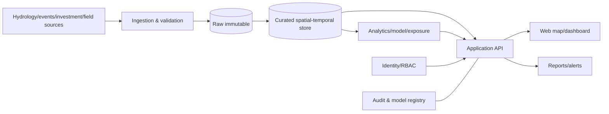

# System Architecture

## Gaya
MVP menggunakan modular monolith dan worker terpisah. Ingestion, quality, analytics, API, report, serta IAM memiliki batas modul jelas agar dapat dipisah bila skala meningkat.

## Layers
Source adapters → raw → staging → curated → features → model output → presentation. Raw menyimpan checksum dan waktu pengambilan; presentation memakai read model, bukan raw table.

## Komponen
Scheduler/connectors; data quality; PostGIS-ready store; event/exposure engine; Forecast/NowCast; scoring; report generator; notification; API/web; IAM; audit/model registry; object storage.

## Deployment baseline
Reverse proxy/TLS; web/API; background worker; PostgreSQL+PostGIS sebagai serving/analytics layer; MariaDB/MySQL dapat tetap menjadi source; Redis opsional; S3-compatible object storage; centralized logs/metrics; backup.

## Aturan desain
- UTC internal; tampilan Asia/Jakarta.
- CRS sumber dicatat; serving geometry EPSG:4326; perhitungan jarak memakai CRS proyeksi sesuai.
- Model outputs immutable per run/version.
- Alert idempotent dengan deduplication key.
- Feed stale tetap berlabel stale; koordinat invalid dikarantina; model gagal fallback atau `insufficient_data`.
