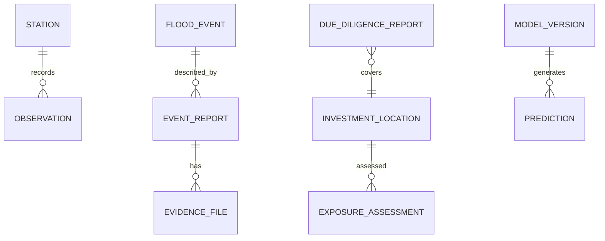

# API and Canonical Data Model

## API `/api/v1`
`GET /locations`, `/locations/{id}`, `/locations/{id}/exposure`, `/observations`, `/nowcast`, `/forecasts`, `/events`, `/portfolios/{id}/exposure`, `/metadata/sources`, `/models`; `POST /due-diligence-reports`, `/alerts/{id}/acknowledge`.

Response memuat `data`, `meta.generated_at`, source IDs, quality, freshness, CRS, limitations, dan errors. Error codes: `INVALID_COORDINATE`, `INSUFFICIENT_DATA`, `STALE_SOURCE`, `FORBIDDEN_CLASSIFICATION`, `MODEL_NOT_OPERATIONAL`, `CONFLICTING_RECORDS`.

Gunakan OAuth2/OIDC atau mekanisme pemerintah setara, object-level checks, rate limit, signed URL singkat untuk evidence, audit export/publish/restricted access, dan `Idempotency-Key` untuk report/alert.

## Entitas kanonik
`data_source`, `ingestion_run`, `quality_issue`, `organization`, `user/role/permission`, `spatial_unit`, `station`, `sensor`, `observation`, `threshold_version`, `flood_event`, `event_report`, `evidence_file`, `asset`, `asset_condition/operation`, `investment_location/project`, `portfolio/item`, `hydrologic_relation`, `model/version/run`, `prediction`, `exposure_assessment`, `resilience_assessment`, `recommendation`, `due_diligence_report`, `alert/delivery`, `audit_log`.

## Aturan model
Stable internal ID; source ID terpisah; valid time untuk status/threshold/ownership; geometry point/line/polygon dengan accuracy/source/CRS; binary evidence di object storage; prediction/assessment immutable per run; spatial join menyimpan method, distance, relationship, confidence.

